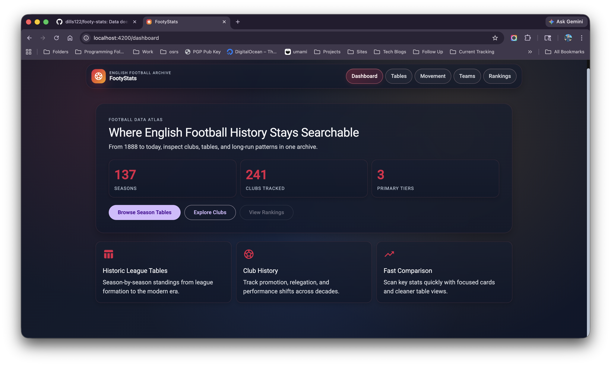
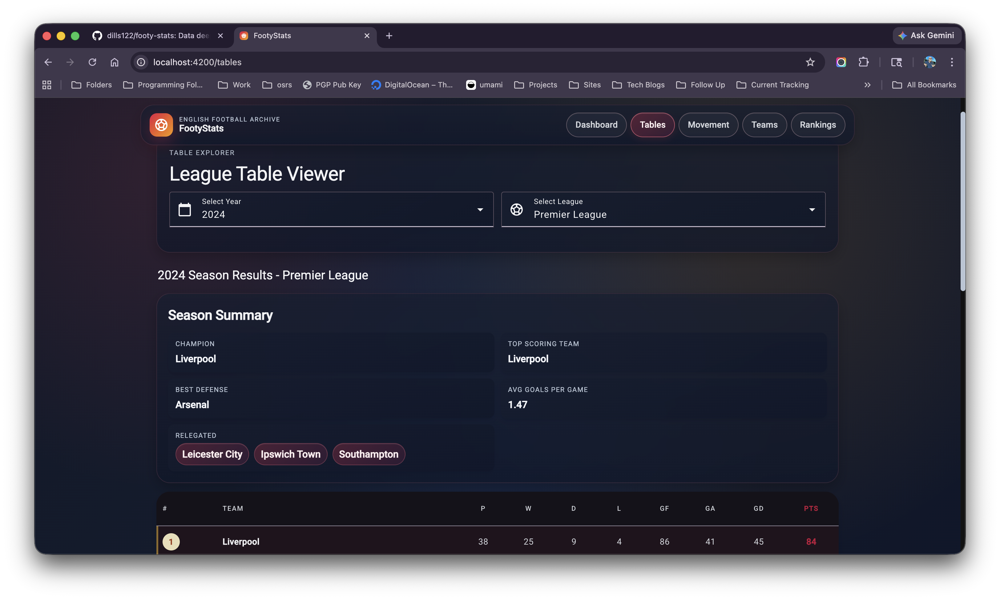
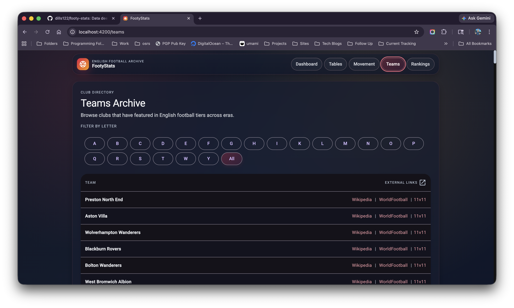

# Football Stats (WIP)

A web application for viewing historical football statistics, only focused on Premier League data.

Running Site: [Footy-Stats](https://dills122.github.io/footy-stats/dashboard)





## Getting Started

```bash
nvm use
pnpm install
pnpm start
```

### Angular Theme

```bash
ng generate @angular/material:theme-color
```

## AI Central Context

This repo uses AI Central steering and local Codex skill links.

Tracked files:

- `AGENTS.md`
- `.codex/steering/repository-steering.md`
- `.codex/steering/testing-quality-gates-steering.md`

Ignored local links:

- `.codex/skills/`
- linked shared steering under `.codex/steering/`

Refresh local symlinks with:

```bash
pnpm codex:links
```

By default this expects AI Central at `../ai-central` relative to this repository. Set
`AI_CENTRAL_HOME` if your checkout lives somewhere else.
